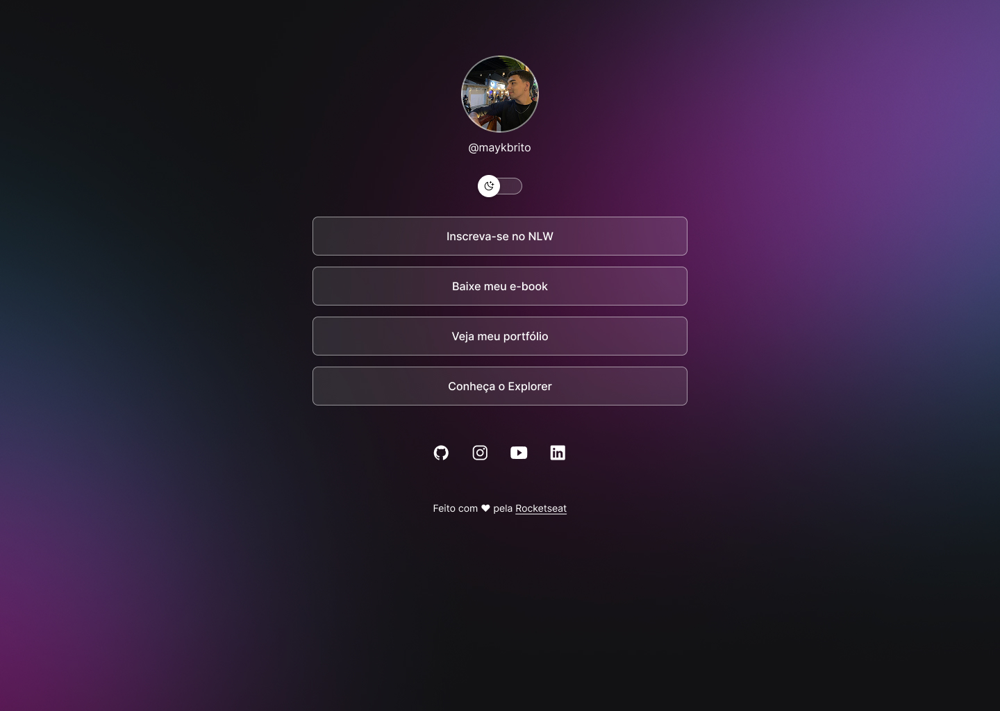

<h1 align="center"> DevLinks </h1>

Projeto promovido pela Rockseat para ensino de tecnologias WEB.

 
  <a href="#tecnologias">Tecnologias</a>&nbsp;&nbsp;&nbsp;/&nbsp;&nbsp;&nbsp;
  <a href="#projeto">Projeto</a>&nbsp;&nbsp;&nbsp;/&nbsp;&nbsp;&nbsp;
  <a href="#layout">Layout</a>&nbsp;&nbsp;&nbsp;/&nbsp;&nbsp;&nbsp;
  <a href="#licença">Licença</a>

 

  

## Tecnologias

Esse projeto foi desenvolvido com as seguintes tecnologias:

- HTML e CSS
- JavaScript
- Git e Github
- Figma

## Projeto

O DevLinks é um projeto com foco em estudo de CSS com aplicação JavaScript

## Layout

Você pode visualizar o layout do projeto através desse [LINK](https://www.figma.com/community/file/1187422022288947321)

## Licença

Esse projeto está sob a licença MIT.